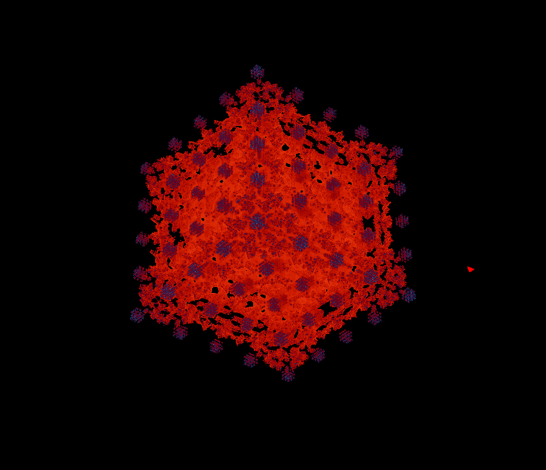

## About me

I got my degree in Grado en Desarrollo de Videojuegos in Facultad de Informática of Universidad Complutense de Madrid in 2020, and throughout my years of student I participated in many different projects of different sizes and collaborators, experiencing and learning about several roles and disciplines. However, my favourite role is programming and I love solving problems and make ideas come true by coding.     
I’ll leave you here some of the projects I worked on. I usually lean on GitHub to organize my work and develop big projects, so you can see most of them in my account [here](https://github.com/jorgerodrigar).

---

## Projects

### TFG (final dissertation of the degree) - 2020
This project consists on fractal terrains generation and their implementation via OpenGL and Vulkan graphic APIs. It also combines two different rendering methods, the usual one to visualize 3D models and meshes, and the Ray Marching method to recreate de fractal terrains, both of them developed by render shaders. Mixing these methods and adding some physics, it results on a scene with an object controlled by the player that can explore several terrains created through 3D fractals.     
I made this project with two classmates, and I contributed programming the OpenGL and Vulkan versions of the application, just as the suitable coexistence between them. I also worked on programming the shaders, the physics and introducing the 3D models.     
This project has been programmed in C++ using Visual Studio.     

   

You can find the TFG project [here](https://github.com/jorgerodrigar/TFG-Repo).

### Holy Spoons - 2019
Holy Spoons is a first person shooter videogame in which the player has to survive against infinite waves of enemies, improving some skills such as his velocity or his weapons.
The main point of this project was to create a videogame engine which allowed to develop any type of game on it without changing its architecture. It was developed by 6 people and uses functionalities of several libraries to work properly: Ogre3D for the graphics, Nvidia Physx for the physics and irrKlang for the 3D positional sound. It is all mixed on an interface based on components, making the game development similar to Unity’s workflow. It also has a data-oriented structure, which means that the game scenes and levels can be configured from external json files and don’t need to introduce new code.     
I contributed implementing the sound engine, the data-oriented structure, programming the components-based architecture of the engine and the gameplay of the game, such as designing its gameflow and similar issues.     
This project has been programmed in C++ using Visual Studio.   

     

You can find the Holy Spoons project [here](https://dimateos.github.io/Holy_Spoons/).

### Moonace - 2018
Moonace is a 2D graphic adventure videogame based on a cyberpunk future in which the player is a homicide detective and must resolve several crimes.     
This project was made by 8 people and programmed in C++ using a structure based on components as Unity does. SDL was used as graphic library, and it also has a data-oriented structure, which means that the game scenes and levels can be configured from external json files and don’t need to introduce new code.     
I contributed programming the components-based architecture, gameplay of the game like the point and click movement mechanic using the A* algorithm, the sound engine and several art assets.     

     

You can find the Moonace project [here](https://bitlegion.itch.io/moonace).

### Donkey Kong clone - 2017
It was developed by two people using Phaser and JavaScript, and it’s a clone of the classic videogame Donkey Kong.     
I contributed in the programming and art assets inclusion.       

     

     

You can play it from your browser [here](https://gonzsa04.github.io/DonkeyKong/PVLI/src/) (Preferably Mozilla Firefox).

### Katharia - 2017
Katharia is a 2D adventure game in which the player is a hero that must save an ancient kingdom called Katharia from an evil governor. It has platforming and combat mechanics similar to classic beat ‘em up games.     
It was developed in C# using Unity by four people and I contributed programming its gameplay mechanics, some boss fights, designing levels and creating art assets.     

     

### PS4 projects - 2019
I made some projects for PS4 using its SDKs and programming in C++. I also cloned the classic videogame West Bank and made it multiplatform for PS4 and PC, stablishing an interface-based architecture, in which the gameplay code of the game worked identically for both platforms.     
You can find the repository of the PC version of the game [here](https://github.com/jorgerodrigar/PC_Consoles_Projects).

### Mobile games - 2019
I made some mobile videogames based on puzzles and skill using Unity and programming in C#, and Android Studio and programming in Java. I also made them multiplatform for PC and Android, stablishing an interface-based architecture, in which the gameplay code of the games worked identically for both platforms.     
You can find some of them [here](https://github.com/jorgerodrigar/VJ-en-Moviles).

### Telemetry system - 2020
I made a telemetry system that sends information about games while they are being played to analyse their mechanics and gameplay balance via server using several threads. It was programmed in C++ by five people and can be used in any game (in my chase I stablished the telemetry system in the Moonace project to balance its mechanics and puzzles).     
You can find it [here](https://github.com/jorgerodrigar/Telemetria).

### Continuous integration system - 2020
I made a continuous integration system with other four people in C++ and using Jenkins. This system allows to track the changes made to a project and determines if they are correct or produce new errors that decay the project.     
You can find it [here](https://github.com/jorgerodrigar/Sistema-de-Integracion-Continua).

### AI projects - 2019
I made several AI projects with C# in Unity and using its navigation meshes, path finding algorithms and other methodologies. Some of these projects are AIs that play between them at a Cluedo videogame or at a football simulator videogame.     
You can find them [here](https://github.com/jorgerodrigar/IA).

### Other projects
I also made several projects such as a dynamic music engine in Unity to add soundtracks to videogames, an artificial image recognition via machine learning methods, 3D character animations and modelling, and realistic physics simulations.     

     

---

## Current projects
I am currently taking a professional Unreal Engine 4 course and developing a 3D videogame on it. I am also planning to do small games for Android and IOs.

---

## Contact me

[GitHub](https://github.com/jorgerodrigar)   
[LinkedIn](https://www.linkedin.com/in/jorge-rodriguez-garcia-6b031217a/)   
Correo: jorgerodrigar2703@gmail.com   
